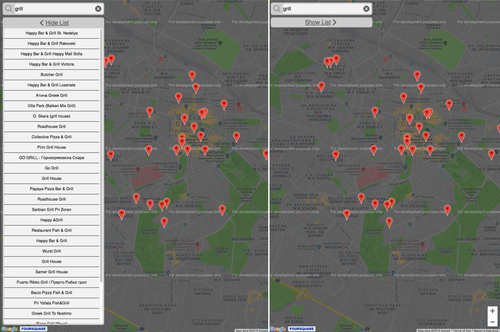
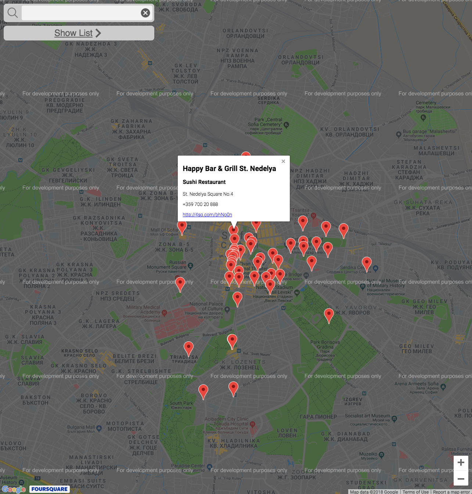
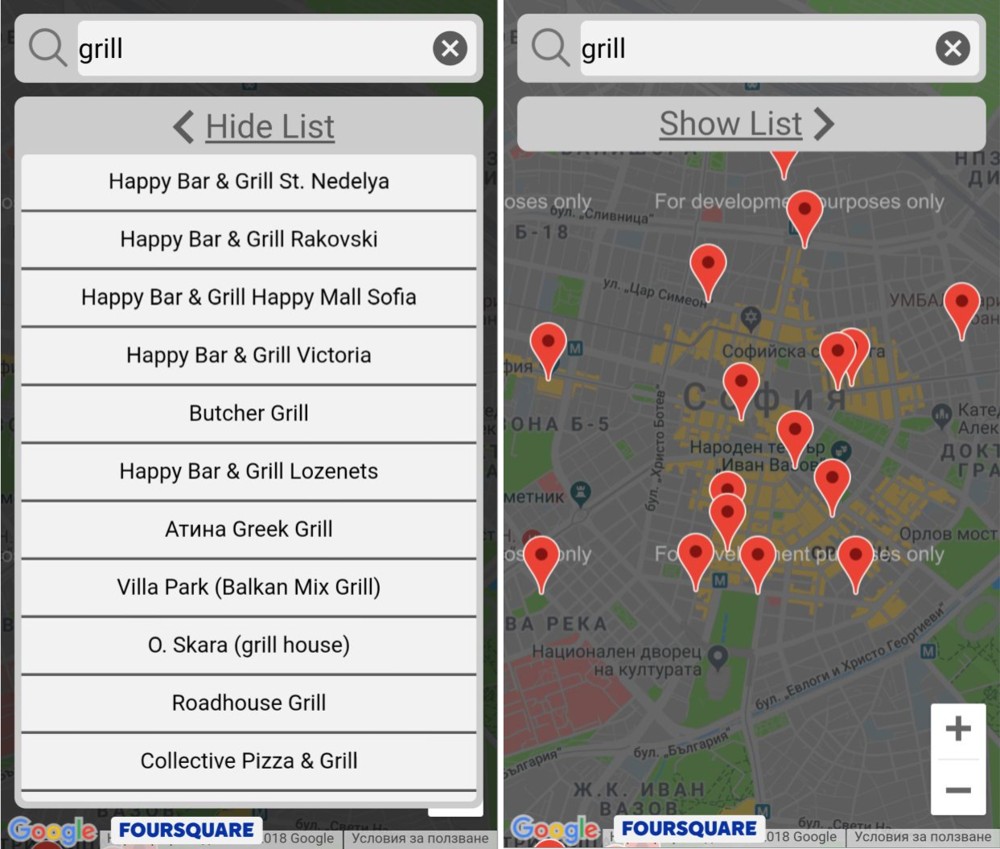

# Neighborhood Project

## Table of Contents

* [About](#about)
* [How to run it](#how-to-run-it)
* [How to use it](#how-to-use-it)
* [Dependencies](#dependencies)

## About

The **Neighborhood** project is Map app written in React.You can search different venues and get information about them from Foursquare. The project emphasizes using React to build the application and the usage of third-party APIs (Google Maps API , Foursquare API)

## How to run it

1) Download or Clone the repository
2) Unzip the file if you have downloaded a ZIP
3) Install dependencies using **npm**:

        npm install

4) Start the application:

* The service worker is only enabled in the production environment,so if you want to use it build the project first. For more information check [Making a Progressive Web App](https://goo.gl/KwvDNy)

        npm run build

* Otherwise just start the server

        npm start

5) This will open new browser window/tab. If it doesn't navigate to

        http://localhost:3000/

## How to use it

On the page you will see three main elements:

* Search Box
* List
* Map

To view information about specific venue you can choose item either from the List or from the map Markers.

*Note: Currently the free subscription of Foursquare API limits the Premium Calls to 50 per Day. Since these calls are used to fetch the Venue Details Information you will get "Unable to fetch Venue Details" error after all 50 calls have been used.*

***

To search specific venue you are interested in just type in the Search Box and your venues will update in both the **Map** and **List**

## Dependencies

* Google Maps API
* Foursquare API
* 'react-async-script-loader'
